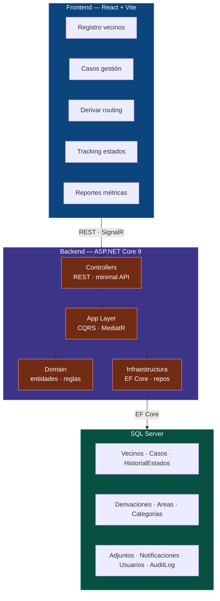
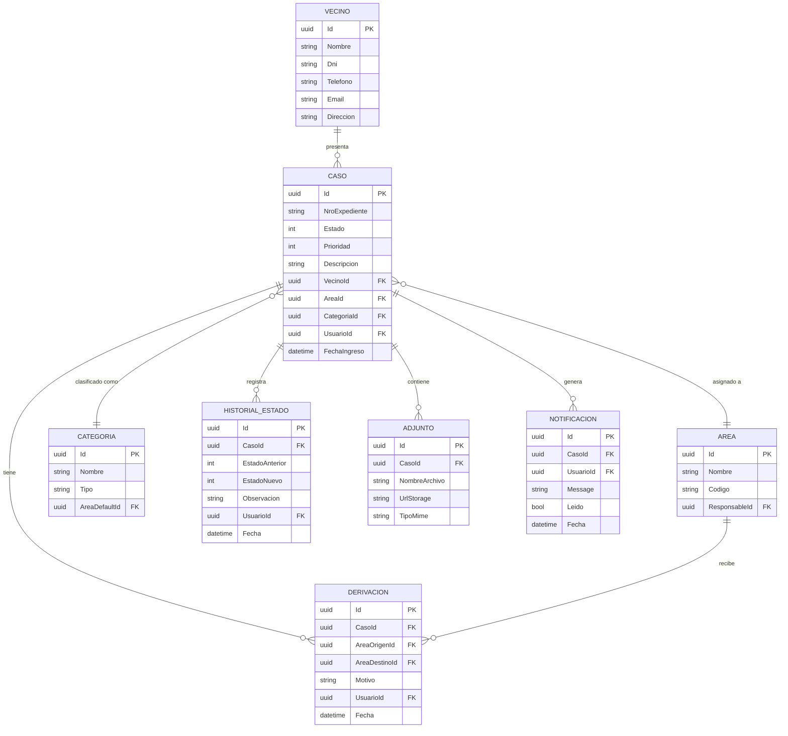

# Código Mermaid para Gráficos - Mesa de Entrada

Este archivo contiene el código fuente para generar los diagramas de arquitectura y el modelo de entidad-relación (ERD) utilizando Mermaid.

## 1. Arquitectura de Sistema

---

## 2. Diagrama de Entidad Relación (ERD)

